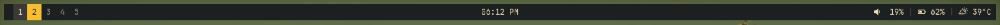

# Lemonbar for Termux

> Build and run **Lemonbar** on Termux with a ready-to-use configuration.

---

## Preview



---

## Included Files

| File | Description |
| --- | --- |
| `build` | Build script for compiling and installing Lemonbar in Termux. |
| `lemonbar` | Startup/configuration script to launch Lemonbar. |

---

## Installation & Usage

### 1) Clone the repository
```bash
git clone https://github.com/nurmuhammedjoy/lemonbar-termux.git
cd lemonbar-termux
```

### 2) Build and install
```bash
chmod +x build
./build
```

### 3) Run Lemonbar
```bash
chmod +x lemonbar
./lemonbar
```

---
